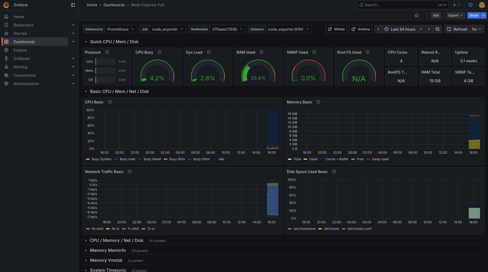

# Stack de monitoring Docker : Grafana, Prometheus, Flask, PostgreSQL, nginx

## Schéma réseau
```
           +-------------------+
           |      nginx        |
           +-------------------+
           |   /grafana/       |
           |   /prometheus/    |
           |   /api/           |
           +-------------------+
                    |
        +-----------+---------------------+
        |           |                     |
+--------+   +-------------+      +-------------+
| Grafana|<-->| Prometheus  |     |  Flask API  |
+--------+   +-------------+      +-------------+
                    |                       |
            +-------+-------+               |
            |               |               |    
    +--------------+   +-------------+  +-------------+
    |Node Exporter |   |Postgres Exp.|  | BDD Postgres|
    +--------------+   +-------------+  +-------------+

Liaisons :
- Grafana interroge Prometheus
- Prometheus collecte les métriques Node/Postgres Exporter
- Postgres Exporter collecte depuis PostgreSQL
- Flask API communique avec PostgreSQL
(frontend et backend sont des réseaux Docker isolés)
```

## Présentation
Ce projet déploie une stack de monitoring moderne. Tu y trouveras :
- **Grafana** pour visualiser les métriques
- **Prometheus** pour collecter les métriques
- **Node Exporter** et **Postgres Exporter** pour exporter les stats système et base de données
- **API Flask** pour tester et manipuler la base
- **PostgreSQL** comme base de données
- **nginx** pour exposer tous les services sur une seule adresse

## Architecture
```
+-------------------+
|     nginx         |
|-------------------|
| /grafana/  ---> grafana:3000
| /prometheus/ ---> prometheus:9090
| /api/       ---> backend:5000
+-------------------+
```
Tout tourne dans Docker Compose, chaque service est isolé sur son réseau.

## Configuration nginx
Le reverse proxy nginx redirige :
- `/grafana/` vers Grafana
- `/prometheus/` vers Prometheus
- `/api/` vers l’API Flask

## Endpoints API Flask
- `GET /api/health` : Vérifie si l’API est en ligne
- `GET /api/tasks` : Liste les tâches
- `POST /api/tasks` : Ajoute une tâche
- `GET /api/` : Message d’accueil

## Exemples de réponses API Flask
- `/api/health` : `{"status": "healthy"}`
- `/api/` : `{"message": "API root OK"}`
- `/api/tasks` : `[]`

## Accès aux services
- Grafana : http://localhost/grafana/
- Prometheus : http://localhost/prometheus/
- API Flask : http://localhost/api/

## Variables d’environnement
Exemple de `.env` :
```
POSTGRES_DB=todo
POSTGRES_USER=todo_user
POSTGRES_PASSWORD=SuperSecretPassword123!
GRAFANA_USER=admin
GRAFANA_PASSWORD=UltraSecureGrafanaPwd!
```

## Sécurité
- Il faut changer les mots de passe avant la mise en production.
- Protège l’accès public avec un firewall ou ta config réseau.

## Démarrage rapide
```bash
docker-compose build
docker-compose up -d
```

## Preuve de fonctionnement
Pour prouver que la stack fonctionne, lance ces commandes :

```bash
curl -s http://localhost/grafana/ | head -n 20
curl -s http://localhost/prometheus/ | head -n 20
curl -s http://localhost/api/health
```

Résultats attendus :
- Grafana : redirection vers la page de login
  ```html
  <a href="/grafana/login">Found</a>
  ```
- Prometheus : redirection vers la page de requête
  ```html
  <a href="/query">Found</a>
  ```
- API Flask :
  ```json
  {"status":"healthy"}
  ```

Voici aussi une capture d’écran du dashboard Grafana qui montre que tout fonctionne :



## Pourquoi nginx ?
Simple, bien documenté, flexible. Ici il remplace Traefik pour que la config soit plus directe et pédagogique.

## Sauvegarde manuelle PostgreSQL
Un script est dispo pour sauvegarder la base à la demande :
```bash
bash scripts/backup-db.sh
```
Le dump est créé dans `/backup` du conteneur. Tu peux monter un volume pour le récupérer sur ta machine.

---
Projet réalisé pour montrer une stack de monitoring moderne avec nginx.
